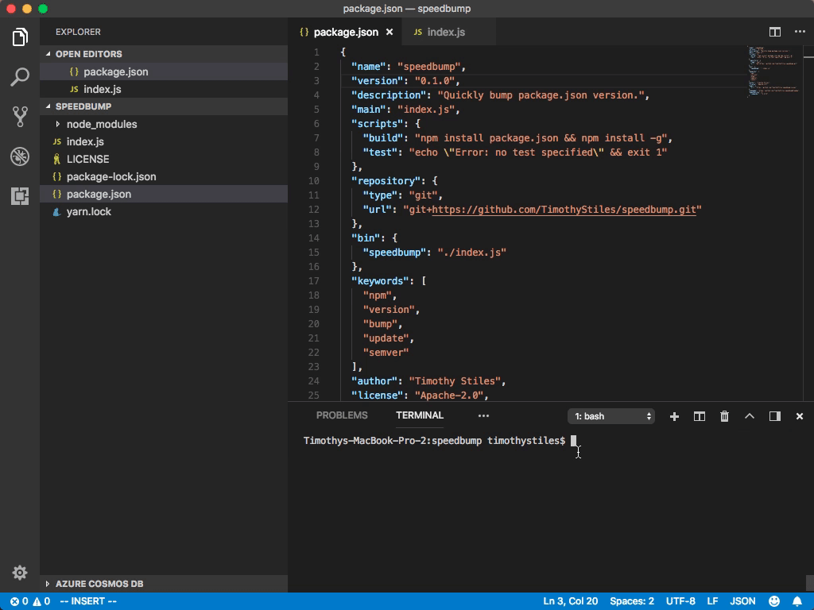

# speedbump
Quickly bump package.json versions.

## installation

```
npm install -g speedbump
```

```
yarn global add speedbump
```

## usage
```
speedbump <flag>
```


### bump patch version

```
speedbump -p
```
or
```
speedbump
```

### bump minor version
```
speedbump -m
```

### bump major version
```
speedbump -M
```

## build from source
```
git clone git+https://github.com/TimothyStiles/speedbump.git && cd speedbump && npm run build
```

## contributing
Please make a fork, and branch to work on new features. Pull request to merge.

Feel free to refactor, add documentation, pretty up the command line interface, add tests, or whatever you want! All pull requests considered.

## license

Copyright 2018 Timothy Stiles

Licensed under the Apache License, Version 2.0 (the "License");
you may not use this file except in compliance with the License.
You may obtain a copy of the License at

    http://www.apache.org/licenses/LICENSE-2.0

Unless required by applicable law or agreed to in writing, software
distributed under the License is distributed on an "AS IS" BASIS,
WITHOUT WARRANTIES OR CONDITIONS OF ANY KIND, either express or implied.
See the License for the specific language governing permissions and
limitations under the License.